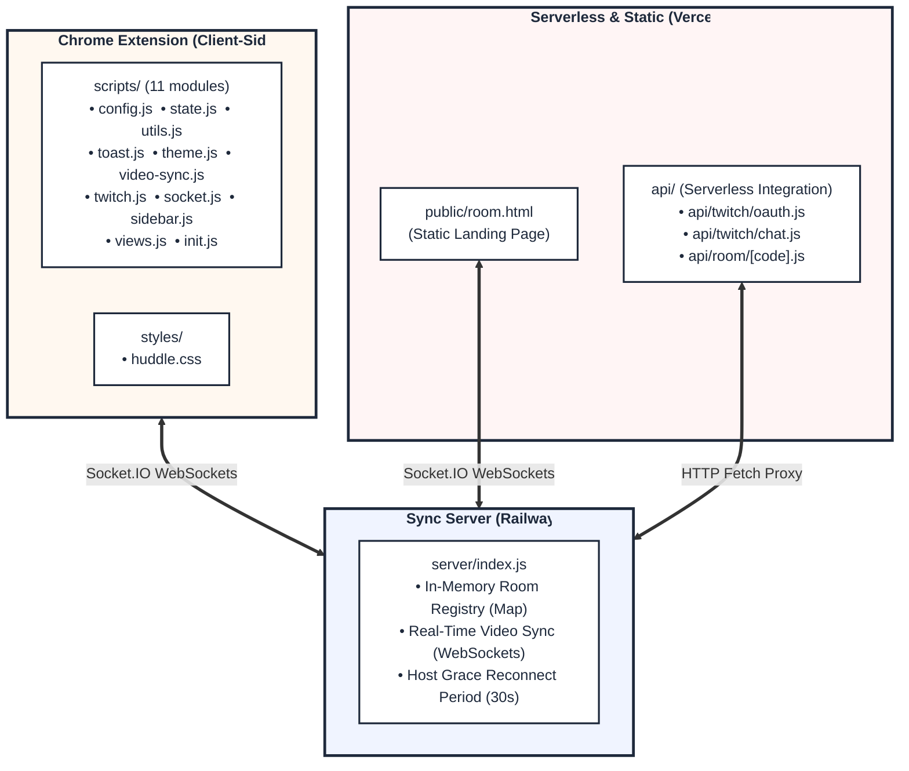

<div align="center">

# 🎬 Huddle

### Watch Together. Sync Perfectly.

A **Chrome Extension** that lets you watch videos with friends in perfect real-time sync — across YouTube, Netflix, Disney+ Hotstar, Prime Video, and Twitch Clips.

[](https://github.com/Full-Stack-boi/Huddle)
[](https://socket.io/)
[](https://nodejs.org/)
[](https://developer.chrome.com/docs/extensions/mv3/)

---


</div>

> [!IMPORTANT]
> 🟣 **Twitch Streamer Integration is currently under active development!**
> Active development is focused on building, testing, and refining the Twitch OAuth implicit grant flow, live status checks, and the serverless proxy to let streamers share Huddle sync rooms directly with their chat in one click.

---

## What is Huddle?

Huddle turns any video streaming session into a **shared experience**. Create a room, share the code, and everyone's video syncs automatically — play, pause, and seek in perfect harmony.

No more counting down _"3… 2… 1… play!"_

---

## Features

### Real-Time Video Sync

- **Event-driven architecture** — play, pause, and seek sync instantly via WebSocket events.
- **1-second heartbeat** — continuous drift correction keeps everyone within 0.5 seconds of the host.
- **Host-controlled** — the Host's playback state is the absolute source of truth.

### Multi-Platform Support

| Platform        | Status       | Notes                                |
| --------------- | ------------ | ------------------------------------ |
| YouTube         | ✅ Supported | Full thumbnail & metadata extraction |
| Netflix         | ✅ Supported | Works on `/watch` pages              |
| Disney+ Hotstar | ✅ Supported | `disneyplus.com` & `hotstar.com`     |
| Prime Video     | ✅ Supported | Amazon Prime Video                   |
| Twitch Clips    | ✅ Supported | `clips.twitch.tv`                    |

### Dynamic Brand Theming & Logos

The sidebar **automatically adapts** its color palette and SVG brand logos to match whichever platform you are currently watching:

- **YouTube** → Soft Coral Red theme with native YouTube SVG logo.
- **Netflix** → Soft Crimson theme with native Netflix SVG logo.
- **Disney+ Hotstar** → Deep Royal Blue theme with native Star/Disney SVG logo.
- **Prime Video** → Sky Prime Blue theme with Prime Video check-style SVG logo.
- **Twitch** → Soft Twitch Purple theme with native Twitch SVG logo.
- **Default/Other pages** → Pastel Lavender theme with custom Clapperboard SVG logo.

When you join someone's room, your sidebar transitions dynamically in real time to match **their** video platform's branding!

### Twitch Streamer Integration

- **OAuth Login** — connect your Twitch account securely via implicit grant flow.
- **Live Status** — see if you're currently live with your real-time viewer count.
- **Share to Chat** — send your Huddle room link directly to your Twitch chat so viewers can join your watch party in one click.

### Room System

- **Unique Room Codes** — auto-generated `HUD-XXXX` codes (using clear, non-ambiguous characters).
- **One-Click Copy** — click the room code to copy it directly to your clipboard.
- **Auto-Join via Link** — share a URL with `#huddle_room=CODE` and friends join instantly.
- **Landing Page** — a beautiful web page where friends can preview the room, see who's in it, and join with/without the extension.

### Viewers Experience

- **Host Crown 👑** — the host is highlighted at the top of the list with a gold crown.
- **Self Indicator** — your name is marked with `(You)` and distinct styling.
- **Expand/Collapse** — toggle the viewers list with a smooth animation.
- **Room Dissolution** — when the host closes the room, guests' sidebars automatically slide open to show a prompt.

### Reliability

- **Auto-Reconnect** — up to 10 reconnection attempts with exponential backoff.
- **Host Grace Period** — 30-second window for hosts to reconnect without losing the room.
- **Cross-Origin Names** — display names persist across all websites via `chrome.storage.local`.

---

## Architecture

Huddle uses a clean, decoupled **modular layout** designed for ease of maintenance and zero build overhead:



---

## Project Structure

```
Huddle/
├── extension/                       # Chrome Extension Assets
│   ├── manifest.json                # Extension config (Manifest V3)
│   ├── background.js                # Service worker
│   ├── vendor/
│   │   └── socket.io.min.js         # Socket.IO client library
│   ├── scripts/                     # Modular content scripts (Global Scope)
│   │   ├── config.js                # Main HUDDLE_CONFIG
│   │   ├── state.js                 # Global let state variables
│   │   ├── utils.js                 # Display name & metadata utilities
│   │   ├── toast.js                 # Toast notification DOM helpers
│   │   ├── theme.js                 # Dynamic brand pastel themes & SVGs
│   │   ├── video-sync.js            # Video detection, listeners, heartbeat
│   │   ├── twitch.js                # Twitch OAuth & chat helpers
│   │   ├── socket.js                # Socket.io listeners & setup
│   │   ├── sidebar.js               # Sidebar builder, toggle & pager
│   │   ├── views.js                 # Component renderers & handlers
│   │   └── init.js                  # Entry-point initialization
│   └── styles/
│       └── huddle.css               # Organized & deduplicated CSS
│
├── server/                          # Real-Time Sync Server (Railway)
│   └── index.js                     # Server entry point
│
├── api/                             # Vercel Serverless Functions
│   ├── twitch/
│   │   ├── oauth.js                 # Twitch OAuth implicit handler
│   │   └── chat.js                  # Twitch chat relay proxy
│   └── room/
│       └── [code].js                # Room metadata JSON proxy
│
├── public/                          # Vercel Static Files
│   └── room.html                    # Real-time room Landing Page
│
├── vercel.json                      # Vercel routing & caching config
├── package.json                     # Server metadata & launch scripts
└── README.md                        # Documentation
```

---

## Getting Started

### Prerequisites

- **Node.js** ≥ 16.0.0
- A **Chromium-based browser** (Chrome, Edge, Brave, Opera, etc.)
- _(Optional)_ A [Twitch Developer Application](https://dev.twitch.tv/console) for streamer integrations

### 1. Clone & Install

```bash
git clone https://github.com/Full-Stack-boi/Huddle.git
cd Huddle
npm install
```

### 2. Run the Sync Server

```bash
# Development (with nodemon auto-reload)
npm run dev

# Production
npm start
```

The server runs on port `4000` by default (or the `$PORT` environment variable).

### 3. Install the Extension in Chrome

1. Open your browser and navigate to **`chrome://extensions/`**
2. Toggle **"Developer mode"** in the top-right corner.
3. Click the **"Load unpacked"** button in the top-left.
4. Select the **`Huddle/extension`** folder.
5. The Huddle extension is now active! Open any supported video (e.g. YouTube) and look for the 🎬 floating button.

### 4. Configuration (Optional)

Update the configuration in [extension/scripts/config.js](file:///C:/Project/Huddle/extension/scripts/config.js):

```javascript
const HUDDLE_CONFIG = {
  syncServerUrl: "http://localhost:4000", // Your Railway or local server URL
  twitchClientId: "YOUR_TWITCH_CLIENT_ID", // Your Twitch App Client ID
  twitchRedirectUri: "YOUR_VERCEL_OAUTH_URL", // e.g. https://domain.app/api/twitch/oauth
  heartbeatInterval: 1000,
  seekThreshold: 0.5,
  reconnectGracePeriod: 30000,
  toastDuration: 4000,
};
```

---

## How to Use

### As a Host

1. Navigate to an actual video watch page on a supported platform.
2. Click the 🎬 floating button to slide out the sidebar.
3. Enter your display name.
4. Click **"🎬 Start New Room"**.
5. Copy the generated room code (e.g., `HUD-A1B2`) and share it with your friends!

### As a Viewer

1. Get the room code from the host.
2. Click the Huddle sidebar button on any page.
3. Enter your name and the room code.
4. Click **"🚪 Join Room"** — your playback state will instantly sync with the host!

### Auto-Join via Link

Hosts can share a direct join link like:

```
https://www.youtube.com/watch?v=VIDEO_ID#huddle_room=HUD-A1B2&name=Friend
```

When friends click this link, the extension **auto-joins the room** instantly without any typing!

---

## Production Deployment

### 1. Sync Server (Railway)

- Connect this GitHub repository to [Railway](https://railway.app).
- Railway automatically detects the `package.json` and runs `npm start` (pointing to `server/index.js`).
- Port binds automatically to Railway's dynamic `$PORT`.

### 2. APIs & Landing Page (Vercel)

- Connect the same repository to [Vercel](https://vercel.com).
- Vercel automatically detects `vercel.json` and spins up the serverless APIs and the landing page.
- Add environment variables in Vercel Console:
  - `TWITCH_CLIENT_ID` — Your Twitch app client ID
  - `SYNC_SERVER_URL` — Your active Railway sync server URL (e.g. `https://huddle-sync.up.railway.app`)

---

## Tech Stack

| Layer              | Technology                      | Purpose                                           |
| ------------------ | ------------------------------- | ------------------------------------------------- |
| **Extension UI**   | Vanilla JS, CSS, Google Fonts   | Responsive cartoon layout & custom SVGs           |
| **Extension Core** | Chrome Storage API, Manifest V3 | Cross-origin displays & background worker         |
| **Sync Server**    | Node.js, Express, Socket.IO     | Real-time WebSocket room coordination             |
| **API Server**     | Vercel Serverless Functions     | Secure Twitch OAuth, chat relay, & metadata proxy |
| **Landing Page**   | Static HTML, CSS, JS            | Real-time playback status & extension auto-check  |

---

## Socket API Events

| Event           | Direction        | Payload                                | Description                                    |
| --------------- | ---------------- | -------------------------------------- | ---------------------------------------------- |
| `createRoom`    | Client → Server  | `{ hostName, videoUrl, ... }`          | Creates a room and assigns host status         |
| `joinRoom`      | Client → Server  | `{ roomCode, name }`                   | Joins a room as a viewer                       |
| `leaveRoom`     | Client → Server  | `{ roomCode, name }`                   | Explicitly leaves a room (viewers)             |
| `closeRoom`     | Client → Server  | `{ roomCode }`                         | Host explicitly dissolves the room             |
| `videoSync`     | Client ↔ Server  | `{ hostTime, isHostPaused, type }`     | Synchronizes play, pause, seek, and heartbeats |
| `reclaimRoom`   | Client → Server  | `{ roomCode, hostName }`               | Reconnects host after a disconnect             |
| `roomCreated`   | Server → Client  | `{ roomCode }`                         | Acknowledges room creation                     |
| `joinSuccess`   | Server → Client  | `{ hostName, videoUrl, viewers, ... }` | Acknowledges successful room join              |
| `viewerJoined`  | Server → Clients | `{ name, viewerCount }`                | Notifies room of a new viewer arrival          |
| `viewerLeft`    | Server → Clients | `{ name, viewerCount }`                | Notifies room of a viewer departure            |
| `roomDissolved` | Server → Clients | —                                      | Notifies room that the host has closed it      |

---

## License

This project is licensed under the **[PolyForm Noncommercial License 1.0.0](https://polyformproject.org/licenses/noncommercial/1.0.0)**.

You are free to view, use, modify, and share this software for **noncommercial purposes only**. Commercial use is not permitted without explicit permission from the author.

---

<div align="center">

**Made by [Full-Stack-boi](https://github.com/Full-Stack-boi)**

</div>
